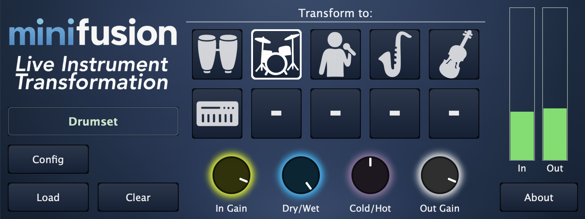

<section class="page-section">
  

    

      

        
        <h2 class="section-heading">Live Instrument Transformation Plugin (Beta)</h2>
        
        <h3 class="section-subheading text-muted mb-5">
          Thank you for completing our Survey! Here are the download links.
        </h3>
        
        
        
        

          

            <a href="https://github.com/fcaspe/PluginReleases/releases/download/v1.0.0/MinifusionLive_macos_arm64_v1.0.0.pkg"
               class="btn btn-xl btn-secondary">
              <i class="fas fa-apple-alt me-2"></i> Download for macOS
            </a>
          

          

            <a href="https://github.com/fcaspe/PluginReleases/releases/download/v1.0.0/MinifusionLive_win_x64_v1.0.0.msi"
               class="btn btn-xl btn-secondary">
              <i class="fab fa-windows me-2"></i> Download for Windows
            </a>
          

        

        

            Formats: VST3 (Windows & macOS) & AU (macOS only). 
        

        
      

    

  

</section>